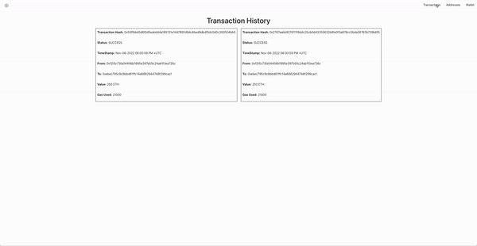

# Installing the Blockchain Explorer

In the project directory, you can run:

### `npm start` - This will install node modules and dependencies

Runs the app in the development mode.\
Open [http://localhost:3000](http://localhost:3000) to view it in your browser.

This project was created by : \
Piyush Himmatsinghka : 101354659 \
Yash Patel : 101395264\
\
\
